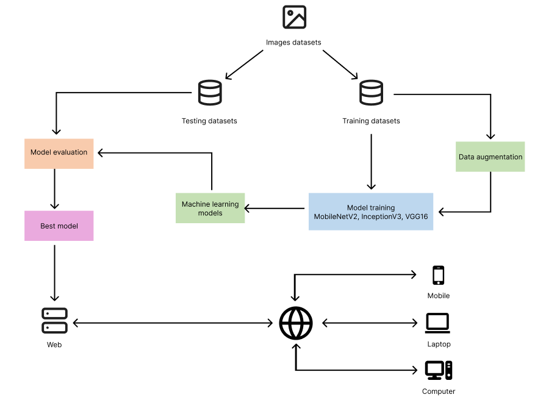
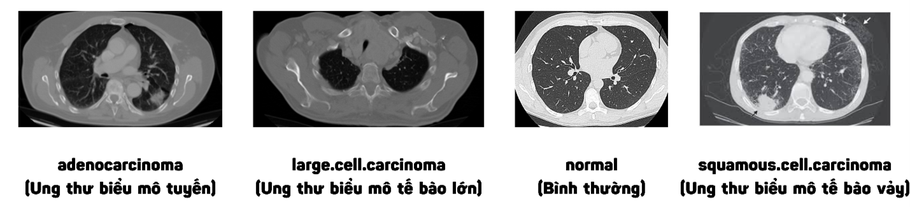
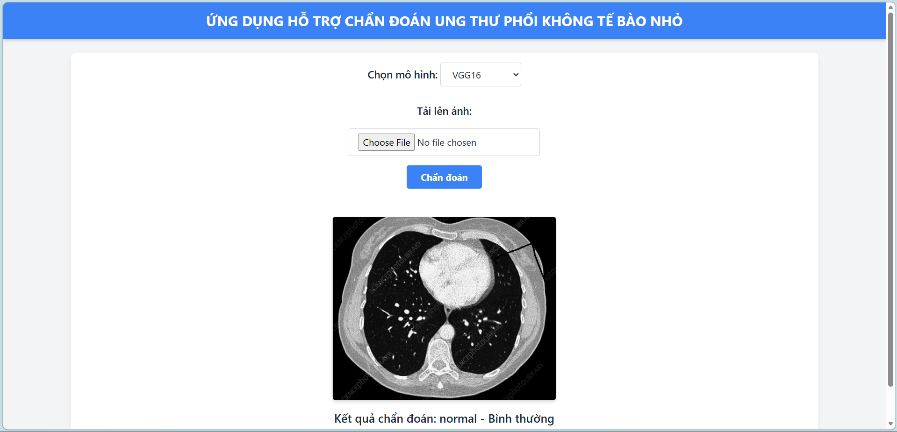

# Ứng dụng hỗ trợ chẩn đoán Ung thư phổi không tế bào nhỏ (NSCLC)

## 1. Giới thiệu dự án (Project Overview)
Dự án tập trung vào việc xây dựng một hệ thống hỗ trợ y bác sĩ chẩn đoán nhanh các loại ung thư phổi không tế bào nhỏ (NSCLC) thông qua việc phân tích hình ảnh chụp cắt lớp vi tính (CT). Hệ thống có khả năng phân loại 4 trạng thái dựa trên ảnh CT:
* **Adenocarcinoma**: Ung thư biểu mô tuyến.
* **Large cell carcinoma**: Ung thư biểu mô tế bào lớn.
* **Squamous cell carcinoma**: Ung thư biểu mô tế bào vảy.
* **Normal**: Phổi bình thường.

## 2. Công nghệ sử dụng (Tech Stack)
Hệ thống được phát triển bằng ngôn ngữ **Python** với các thư viện hỗ trợ chuyên sâu:
* **Deep Learning Frameworks**: `TensorFlow`, `Keras` để xây dựng và huấn luyện mô hình.
* **Xử lý ảnh & Dữ liệu**: `OpenCV` (tiền xử lý ảnh), `NumPy`, `Pandas` (xử lý dữ liệu đầu vào/ra).
* **Web Backend**: `Flask` framework được sử dụng để triển khai web service.
* **Frontend**: `HTML`, `CSS`, `JavaScript`.

## 3. Dữ liệu huấn luyện (Dataset)
Dự án sử dụng tập dữ liệu **Chest CT-Scan images Dataset** từ Kaggle:
* **Link Dataset**: [Kaggle - Chest CT-Scan images](https://www.kaggle.com/datasets/mohamedhanyyy/chest-ctscan-images/data).
* **Quy mô**: 1000 ảnh CT định dạng PNG.

## 4. Huấn luyện mô hình (Training)
Quá trình huấn luyện các mô hình được thực hiện trên nền tảng **Google Colab** để tận dụng sức mạnh của **GPU**. 
Các Notebook đính kèm trong repo bao gồm:
* `VGG16_v2.ipynb`: Mô hình đạt hiệu quả cao nhất với độ chính xác xấp xỉ **96%**.
* `InceptionV3_v2.ipynb`: Mô hình đạt độ chính xác **91.75%**.
* `MobileNetV2_v2.ipynb`: Mô hình nhẹ dành cho thiết bị di động, đạt độ chính xác **67.94%**.

## 5. Ảnh Demo hệ thống

### Kiến trúc tổng quát hệ thống


### Mẫu dữ liệu các lớp


### Giao diện kết quả chẩn đoán thành công


## 6. Hướng dẫn cài đặt (Installation)

### Yêu cầu môi trường
* Python 3.x
* Các thư viện trong `requirements.txt`

### Các bước thực hiện
1. **Clone repository**:
   ```bash
   git clone [https://github.com/phongdao/NSCLC-Diagnosis-System.git](https://github.com/phongdao/NSCLC-Diagnosis-System.git)
   cd NSCLC-Diagnosis-System
2. **Cài đặt các thư viện cần thiết:**
   ```bash
   pip install -r requirements.txt
3. **Chạy ứng dụng:**
   ```bash
   python app.py
Sau đó truy cập http://127.0.0.1:5000 trên trình duyệt.
